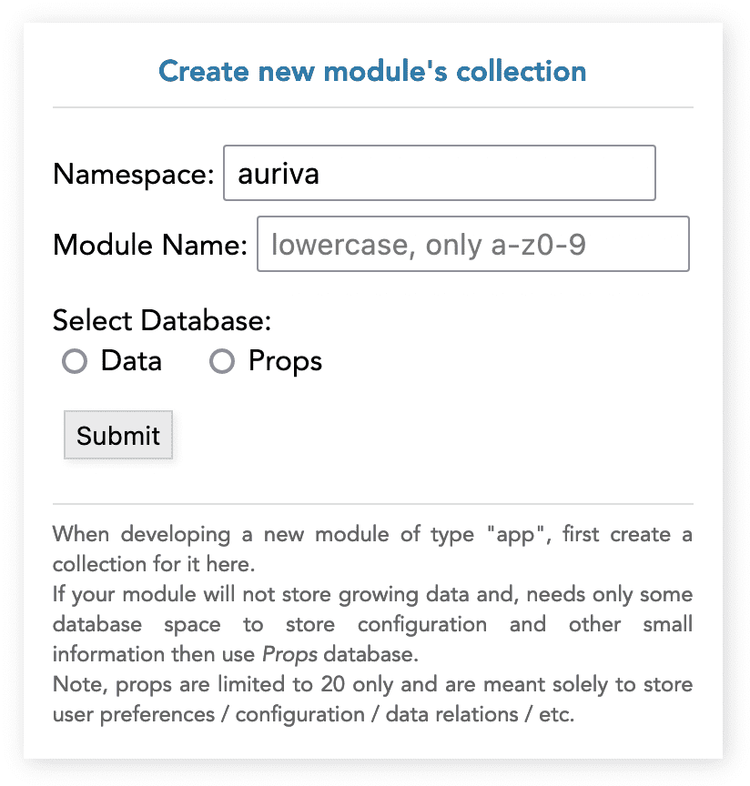
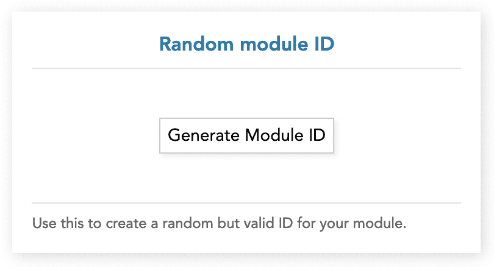

# Fluidspace App Module Template v0.1 (Vue 3)

This is the starter template to develop Modules of ***App*** type for [Fluidspace](https://fluidspace.app).<br>
It is recommended to use this as the base for any new module development for consistent and smoother development experience.

<details>
<summary>More...</summary>

This template contains basic code structure including the Factory, API controller and environment simulation definitions.

The template uses **Vue 3 + Vite** and trimmed-down version of JS files that are used on Fluidspace to invoke and handle modules.

The Vite bundling and build configuration are already defined, we recommend to not change any of it.

The final build is an IIFE with .js in *dist/js/* and all the static assets in *dist/assets/* directory.
Due to the nature of current build process, the built (dist) files may not be directly servable (i.e. independent of Fluidspace Environment).
</details><br>

Configuring & using template video guide: [YouTube](https://youtu.be/BsAzDJM5ILk)

## 🔖 Docs Index
* [What is Fluidspace?](https://gist.github.com/rishiktiwari/645f48422aad7ca7781d1142b3f3b1bd)
* [Module Documentation](docs/Module.md)
* [Data API](docs/DataAPI.md)
* [Props API](docs/PropsAPI.md)


## 🔴 Pre-requisites
- Installed and running [Fluidspace Development Server](https://github.com/FluidspaceWeb/development-server)
- Node.js v18+
- Copy of this repo

<details>
<summary>Recommended IDE Setup</summary>

[VSCode](https://code.visualstudio.com/) + [Volar](https://marketplace.visualstudio.com/items?itemName=Vue.volar) (and disable Vetur).
</details>

## 🟡 Pre-development

### ⬇️ Download Template
```sh
git clone https://github.com/FluidspaceWeb/app-template-vue3.git
```

> **If your module needs database**
>
> Navigate to the *Fluidspace Development Server* web page (default [localhost:1822](http://localhost:1822)) and create a new collection for your module's data.
>
<details>
<summary>See Image</summary>
<div align="center">
    
</div>
</details><br>

> **Generate random module ID**
>
> Click the generate module ID button and copy it.
>
> *Note: This ID is only for development purpose and will be changed automatically when publishing to fluidspace marketplace via the developer platform (coming soon).*
<details>
<summary>See Image</summary>
<div align="center">
   
</div>
</details>

### 📄 Template Configuration

1. Open the [index.html](index.html) and set the following parameters:
    ```json
    {
        "serverUrl": "http://localhost:1822",
        "module": {
            "id": "<valid module id>",
            "namespace": "<namespace>",
            "name": "<modulename>",
            "displayName": "<My Module>"
        }
    }
    ```
    If the module uses database then ensure `namespace` and `name` matches the Database collection name.

2. Open [main.js](src/main.js) and set the **namespace** and **modulename** in the following line:
    ```js
    customElements.define("module-<namespace>_<modulename>", ...)
    ```

3. Similarly, open [App.ce.vue](src/App.ce.vue) and set in **namespace** and **mod_name** in `onMounted()`.

4. Open [Factory.js](src/shared/Factory.js) and set the `MODULE_ID` to the generated ID from previous step.

## 🟢 Development Setup
```sh
npm install
```

### Bundle and launch for Development
```sh
npm run dev
```

*Ignore the testbench.js warning: Failed to load url /testbench.js...*

### Bundle for Production

> Please set the `_MODULES_CDN_BASE_URL` with your ***namespace*** and ***modulename*** in [vite.config.js](vite.config.js) before building and submitting request to upload fluidspace.app.

```sh
npm run build
```

## 📙 Things to consider during development

1. Keep the module concise in terms of features and capabilities. Better to split the features as separate module if not directly related and, use all the modules together as *companion*.

2. Remember that multiple instance of same module may be loaded simultaneously, which overrides the global or file level variables. Therefore, use OOP approach to create instance of such variables in [App.ce.vue](src/App.ce.vue) and pass the instantiated object as *props* or `provide/inject`.

3. The sub-components do not require `.ce.vue` file extension and it is recommended to use only `.vue`.

4. The Vite build includes Vue framework and must **not** be made external. We know that this increases the file size but allows usage of different versions and frameworks in the same Space.

5. There are some known issues with hot-reload not triggering for CSS changes, until then prefer manual refresh.

6. Using `<style>` in sub-components does not work correctly, until then keep `.css` separate and import as many as required in [App.ce.vue](src/App.ce.vue). Example:
    ```html
    <style type="text/css" src="@/assets/base.css" />
    ```

## 🧩 Using Factory in components
Fluidspace supports launching of multiple instances of the module which requires [Factory](src/shared/Factory.js) to be encapsulated for each instance.

The [App.ce.vue](src/App.ce.vue) uses Vue's `provide()` to make the instantiated Factory injectable in any component using `inject('FACTORY')`.

*Note: inject does not support type-check.*

## 📧 Submit module to publish on Fluidspace.app

Email me on [rishik@fluidspace.app](mailto:rishik@fluidspace.app) along with the module files for review and publishing.

The online developer platform is currently under development 😅 and should be live soon.

## ✏️ Roadmap
- Type definition
- Template as npm package
- Testbench toast alert support
- Improve path definition for static assets
