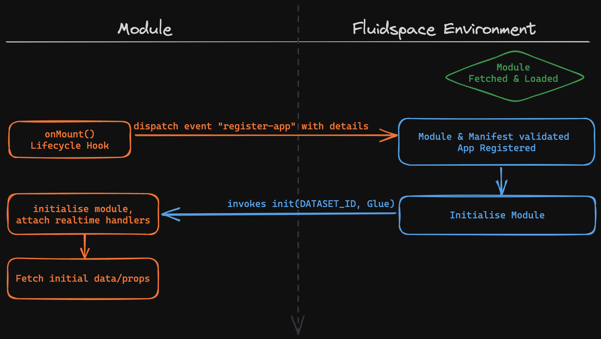

# Module Documentation

This document explains the module registration flow with [Fluidspace](https://fluidspace.app) environment and lists the provided attributes, methods and event listeners.

## 🔖 Docs Index
* [What is Fluidspace?](https://gist.github.com/rishiktiwari/645f48422aad7ca7781d1142b3f3b1bd)
* [Installation Guide](/README.md)
* [Data API](DataAPI.md)
* [Props API](PropsAPI.md)

## ✍️ Module Registration Flow
<div align="center">
    

*Inner data/event flow of environment and module are not shown for the sake of simplicity.*
</div>

<br>

## 🫧 Dispatching "register-app" event
Create a custom event dispatcher to dispatch event from the shadow root of the module when the `onMount()` or ***any similar*** lifecycle hook is invoked. In VueJS this can be achieved by using `defineEmit()` in **src/App.ce.vue**.

The event must be named `register-app` with the following detail:
```ts
{
    id: string,         // Module ID
    namespace: string,  // Namespace for all your modules (a-z0-9, same as in DB)
    mod_name: string,   // Module name, (a-z0-9, same as in DB)
    init: Function,     // Method to be invoked by environment for initialisation (invoked only once)
    refresh: Function   // Method to invoke for refreshing/refetching data
}
```

<details>
<summary>Example Vue3 implementation</summary>

```js
const emit = defineEmits([ 'register-app' ]);

onMounted(() => {
    emit('register-app', {
        id: 'QnlSaXNoaWtUaXdhcmk=',
        namespace: 'auriva',
        mod_name: 'mymodule',
        init: initialise,
        refresh: refresh
    });
});

function initialise(dataset_id, Glue) { ... }
function refresh() { ... }
```

⬆️ The above example is for Vue setup API.

</details>

<br>

## 🤝 Glue Definition

The `Glue` object contains several properties and methods to "***glue***" the module with Fluidspace environment and its features. The environment vie Glue acts as proxy between module and server to trigger other events, handle error and other redundant aspects.

The `Glue` object is provided as 2nd parameter to the method defined in `init` as outcome of module's `register-app` event.

#### Properties:
```ts
Glue = {
    getProperties: Function, // return type below
    getShadowRoot: Function, // returns ShadowRoot of module element 
    subscribe: {
        dataCreated(handler: Function),
        dataUpdated(handler: Function),
        dataDeleted(handler: Function)
    },
    unsubscribe: {
        dataCreated(),
        dataUpdated(),
        dataDeleted()
    }
}
```

```ts
Glue.getProperties(): {
    module_id: string,
    dataset_id: string,
    page_id: string,
    permission_mode: number
}
```

<br>

## 👂 Environment Event Listeners

### 🔹 register-app

To register the module and initialise it.

### 🔹 show-toast 

To trigger Environment toast notification.
***Remember to dispatch event from the root element if the event does not bubbles.***

Required parameters in event `detail`:
```ts
{
    severity_type: ('error' | 'warn' | 'info' | 'success'),
    message: string
}
```

<br>

## 🏷 Module HTML Attributes
| attribute name | definition |
|----------------|------------|
| data-mid       | Module ID  |
| dsid |    Active Dataset ID
| view-select | User's allowed CRUD permission type.<br>Use this value to show and hide different views/components as appropriate. <br>1 - view only<br>4 - view, update, insert<br>9 - view, update, insert, delete |
| period-start | Environment date range start value (in ms) | 
| period-end | Environment date range end value (in ms) | 

